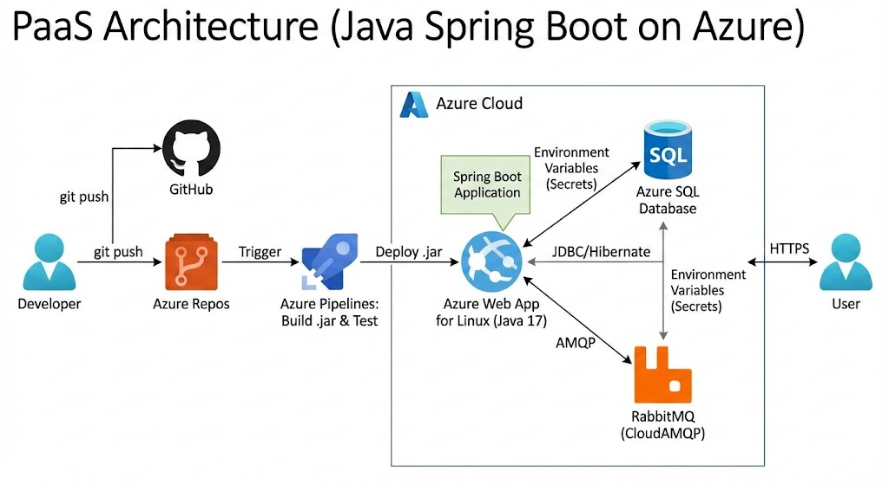

# 🚀 Global Solution 2025 - DevOps Tools & Cloud Computing

## 👥 Grupo LTAKN - O Futuro do Trabalho

* **Vinicius Prates Altafini** - RM 559183
* **Lucas Resende Lima** - RM 556564
* **Enzo Prado Soddano** - RM 557937

---

## 🔗 Links de Entrega

* **Aplicação (Azure Web App):** [https://webapp-ltakn-2025-vini.azurewebsites.net](https://webapp-ltakn-2025-vini.azurewebsites.net)
* **Azure DevOps (Projeto):** [https://dev.azure.com/RM5591830661/GS_2025_LTAKN](https://dev.azure.com/RM5591830661/GS_2025_LTAKN)
* **Vídeo de Demonstração (YouTube):** []
* **Repositório (GitHub):** [https://github.com/vinicius945/SprintGlobalSolutions.git]

---

## 📌 1. Descrição da Solução

A **Gestão LTAKN** é uma plataforma focada no **bem-estar corporativo e prevenção de burnout**. A solução monitora indicadores de jornada de trabalho e gera alertas proativos baseados em dados, utilizando tecnologia para proteger a saúde mental dos colaboradores.

### Arquitetura da Solução (PaaS)
Este projeto segue rigorosamente a arquitetura **PaaS (Platform as a Service)**, garantindo escalabilidade e simplicidade de gestão sem o uso de contêineres, conforme requisitos da Global Solution.

* **Linguagem:** Java 17 (Spring Boot 3)
* **Build & Test:** Maven
* **Banco de Dados:** Azure SQL Database (PaaS)
* **Hospedagem:** Azure Web App for Linux (Java 17 Runtime)
* **CI/CD:** Azure Pipelines (YAML Multi-stage)
* **Mensageria:** RabbitMQ (CloudAMQP)

---

## 🗺️ 2. Desenho da Arquitetura



**Fluxo DevOps:**
1.  **Code:** Commit no Azure Repos (Branch `main`).
2.  **CI (Build):** O Pipeline compila o Java, **executa os testes unitários (JUnit)** e publica o artefato `.jar`.
3.  **CD (Release):** O Pipeline faz o deploy automático do artefato no Azure Web App.
4.  **Monitoramento:** O Web App conecta-se ao Azure SQL e RabbitMQ via Variáveis de Ambiente seguras.

---

## 📋 3. Exemplos de CRUD (JSON) - Requisito 15

Abaixo estão os payloads JSON utilizados para testar os endpoints da API.

### 🏢 Departamentos

**POST /api/departamentos** (Criar)
```json
{
  "nome": "Desenvolvimento Full Stack",
  "numeroHorasMaximas": 160
}
GET /api/departamentos/{id} (Retorno)

JSON

{
  "id": 1,
  "nome": "Desenvolvimento Full Stack",
  "numeroHorasMaximas": 160
}
👤 Funcionários
POST /api/funcionarios (Criar)

JSON

{
  "nome": "João da Silva",
  "departamentoId": 1,
  "horasTrabalhadasUltimoMes": 170,
  "status": "EM_RISCO"
}
Nota: O sistema calcula automaticamente o status baseado nas horas do departamento.

💻 4. Como Rodar Localmente
Como a aplicação é Java Nativo, não é necessário Docker.

Pré-requisitos
Java JDK 17 instalado.

Variáveis de ambiente configuradas (Banco de Dados e RabbitMQ).

Passo a Passo
Clone o repositório.

Configure as variáveis no seu terminal (Git Bash ou PowerShell):

Bash

export SPRING_DATASOURCE_URL="jdbc:sqlserver://sqlserver-gsfinal-945.database.windows.net:1433;databaseName=sqldb-gsfinal;..."
export SPRING_DATASOURCE_USERNAME="adminGSFINAL"
export SPRING_DATASOURCE_PASSWORD="SEU_PASSWORD_AQUI"
# ... (outras variáveis do RabbitMQ)
Execute o projeto com Maven Wrapper:

Bash

./mvnw spring-boot:run
Acesse: http://localhost:8080

☁️ 5. Infraestrutura como Código (Azure CLI)
Os recursos foram provisionados utilizando o script abaixo (disponível em /scripts/script-infra.sh).

Recursos Criados:

Resource Group: rg-gsfinal

App Service Plan: plan-gs-java-paas (Linux B1)

Web App: webapp-ltakn-2025-vini

SQL Server: sqlserver-gsfinal-945

Bash

#!/bin/bash
# Script de Provisionamento Simplificado (PaaS)

RG="rg-gsfinal"
LOCATION="eastus2"
PLAN_NAME="plan-gs-java-paas"
APP_NAME="webapp-ltakn-2025-vini"

# 1. Criar Plano de Serviço (Linux)
az appservice plan create --name $PLAN_NAME --resource-group $RG --sku B1 --is-linux --location $LOCATION

# 2. Criar Web App (Java 17 Nativo)
az webapp create --name $APP_NAME --resource-group $RG --plan $PLAN_NAME --runtime "JAVA:17-java17"

# 3. Configurar Variáveis de Ambiente (Conexão Segura)
az webapp config appsettings set --resource-group $RG --name $APP_NAME --settings \
  SPRING_DATASOURCE_URL="..." \
  SPRING_DATASOURCE_USERNAME="..." \
  WEBSITES_PORT="8080"
🧪 6. Testes Automatizados
O projeto possui testes unitários (JUnit) que são executados automaticamente em cada Pipeline de Build.

Local dos Testes: src/test/java

Publicação: Os resultados são publicados na aba "Tests" do Azure DevOps a cada execução.